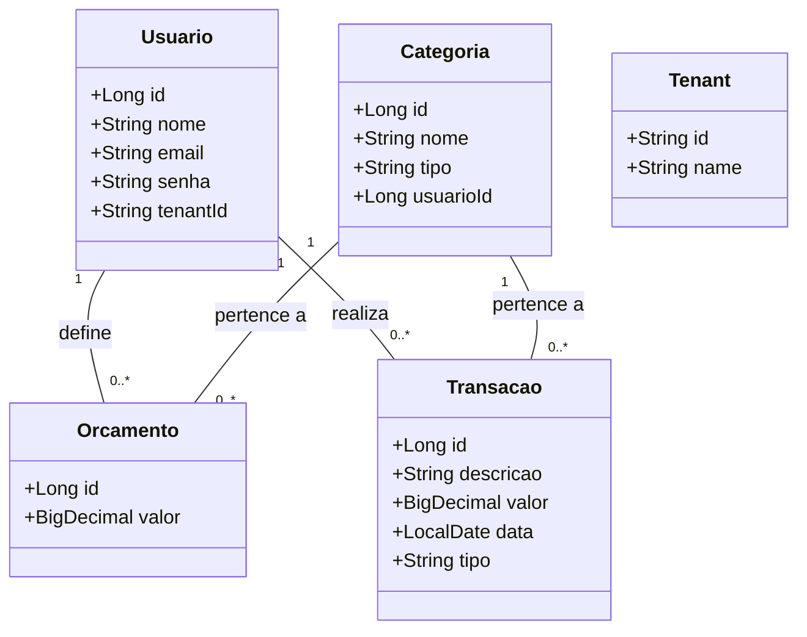

# API de Controle Financeiro

## 1. Visão Geral

Esta é uma API RESTful projetada para ser o backend de um aplicativo de controle financeiro pessoal. A API permite que os usuários gerenciem suas finanças de forma segura e eficiente, rastreando despesas e receitas, definindo orçamentos e categorizando transações. A arquitetura é multitenant, o que significa que os dados de cada usuário são isolados e seguros.

## 2. Funcionalidades Principais

- **Gerenciamento de Usuários e Autenticação**:
    - Registro de novos usuários.
    - Autenticação segura usando JSON Web Tokens (JWT).
    - Funcionalidade de redefinição de senha por e-mail.
- **Gerenciamento de Transações**:
    - Criação, leitura, atualização e exclusão (CRUD) de transações financeiras (receitas e despesas).
- **Categorização**:
    - Criação e gerenciamento de categorias personalizadas para as transações.
- **Orçamentos**:
    - Definição de orçamentos mensais por categoria para ajudar no controle de gastos.
- **Dashboard**:
    - Endpoints para fornecer dados agregados para a construção de um dashboard financeiro, como saldo total e gastos por categoria.

## 3. Arquitetura

A aplicação segue uma arquitetura em camadas, separando as responsabilidades em:

- **Controllers**: Camada responsável por expor os endpoints da API, receber as requisições HTTP e retornar as respostas.
- **Services**: Onde reside a lógica de negócio da aplicação.
- **Repositories**: Camada de acesso a dados, responsável pela comunicação com o banco de dados usando Spring Data JPA.
- **Models**: Entidades que representam as tabelas do banco de dados.
- **DTOs (Data Transfer Objects)**: Objetos para transferir dados entre as camadas, especialmente entre os controllers e os services, evitando a exposição direta das entidades do modelo.

### Diagrama de Classes (Mermaid)



## 4. Segurança

A segurança da API é baseada em autenticação via **JWT (JSON Web Token)**.

1.  O usuário envia suas credenciais (email e senha) para o endpoint `POST /auth/login`.
2.  A API valida as credenciais e, se forem corretas, gera um token JWT assinado.
3.  Este token é retornado ao cliente.
4.  Para acessar endpoints protegidos, o cliente deve incluir o token no cabeçalho `Authorization` de cada requisição, no formato `Bearer <token>`.

## 5. Referência da API

### 5.1. Autenticação

#### `POST /auth/register`
Registra um novo usuário.
- **Request Body**:
  ```json
  {
    "nome": "Seu Nome",
    "email": "usuario@email.com",
    "senha": "sua_senha"
  }
  ```

#### `POST /auth/login`
Autentica um usuário.
- **Request Body**:
  ```json
  {
    "email": "usuario@email.com",
    "senha": "sua_senha"
  }
  ```
- **Success Response (200 OK)**:
  ```json
  {
    "token": "seu_token_jwt"
  }
  ```

### 5.2. Categorias
*(Requer autenticação)*

#### `POST /categorias`
Cria uma nova categoria.
- **Request Body**:
  ```json
  {
    "nome": "Lazer",
    "tipo": "DESPESA"
  }
  ```

#### `GET /categorias`
Lista as categorias do usuário.

### 5.3. Orçamentos
*(Requer autenticação)*

#### `POST /orcamentos`
Define um orçamento para uma categoria.
- **Request Body**:
  ```json
  {
    "valor": 500.00,
    "categoriaId": 1
  }
  ```

#### `GET /orcamentos`
Lista os orçamentos do usuário.

### 5.4. Transações
*(Requer autenticação)*

#### `POST /transacoes`
Cria uma nova transação.
- **Request Body**:
  ```json
  {
    "descricao": "Cinema",
    "valor": 50.00,
    "data": "2024-05-20",
    "tipo": "DESPESA",
    "categoriaId": 1
  }
  ```

#### `GET /transacoes`
Lista as transações do usuário.

## 6. Configuração e Execução

### Pré-requisitos
- Java 21
- Maven
- PostgreSQL

### Passos

1.  **Clone o repositório:**
    ```bash
    git clone <url-do-repositorio>
    cd ControleFinanceiro-API
    ```

2.  **Configure o Banco de Dados:**
    - Crie um banco de dados no PostgreSQL.
    - Renomeie o arquivo `application.properties.example` para `application.properties` (ou configure as variáveis de ambiente).
    - Altere as seguintes propriedades no `src/main/resources/application.properties` com as suas credenciais do PostgreSQL:
      ```properties
      spring.datasource.url=jdbc:postgresql://localhost:5432/seu_banco
      spring.datasource.username=seu_usuario
      spring.datasource.password=sua_senha
      ```

3.  **Execute a aplicação:**
    ```bash
    mvn spring-boot:run
    ```
    A API estará disponível em `http://localhost:8080`.
